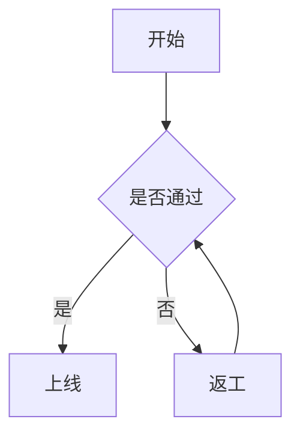
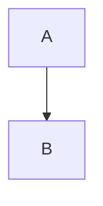
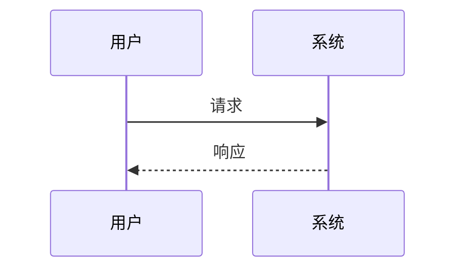

# Mermaid 测试

## 1. 带属性的图


```mermaid {theme=default width=30% alt=决策流程}
graph TD
    A[开始] --> B{是否通过}
    B -->|是| C[上线]
    B -->|否| D[返工]
    D --> B
```

## 2. 坏图（语法错误）

```mermaid
this is [[not valid mermaid
```

## 3. 嵌套在外层围栏中的示例（不应渲染）

````markdown
示例文档：

```mermaid
graph TD; A-->B;
```
````

## 4. 普通图


```mermaid
sequenceDiagram
    participant U as 用户
    participant S as 系统
    U->>S: 请求
    S-->>U: 响应
```
